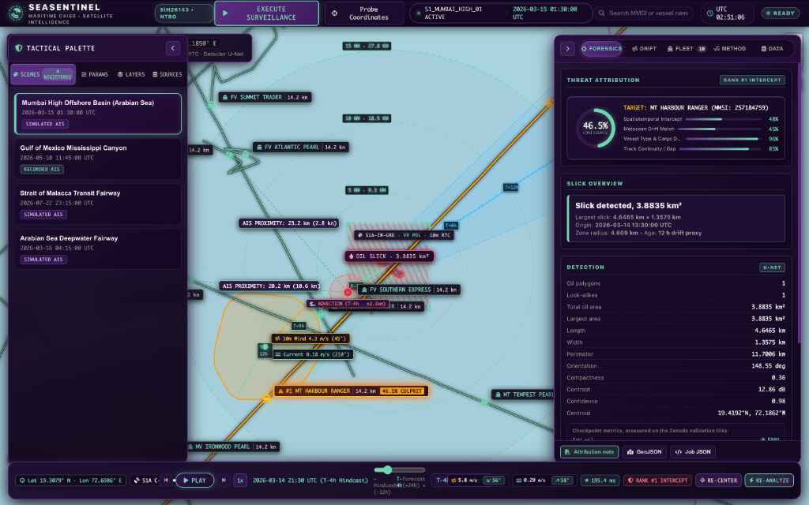
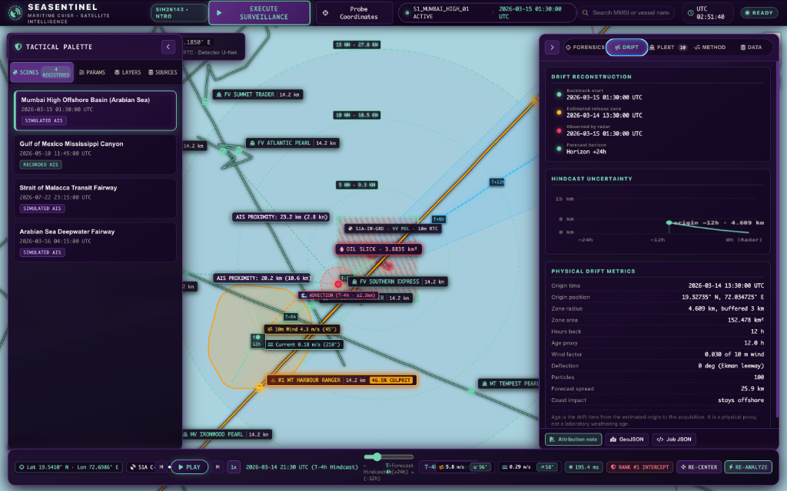
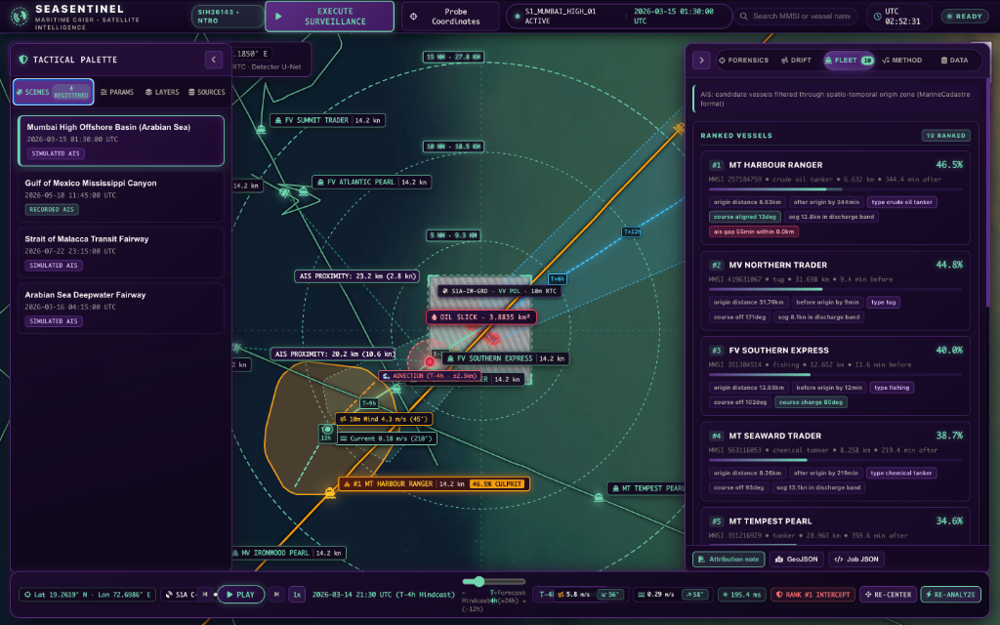
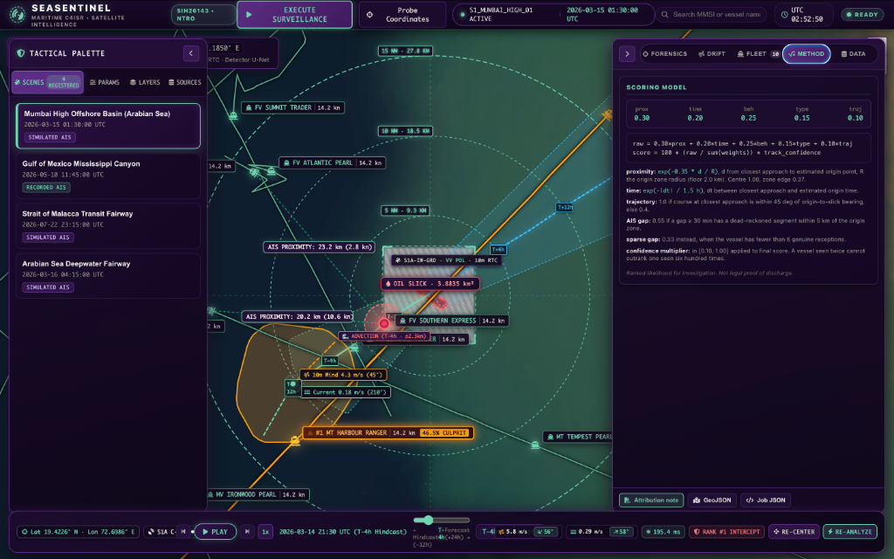
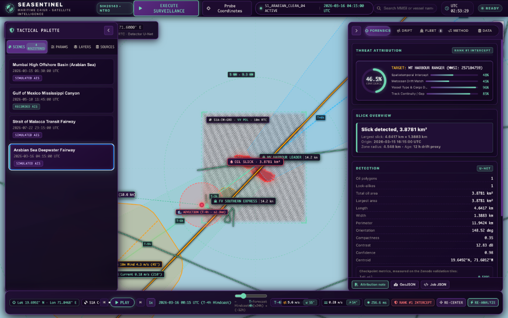
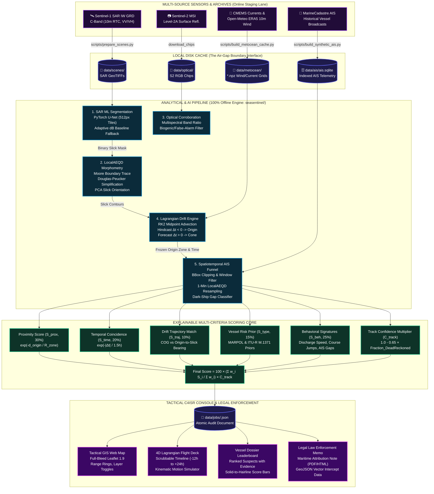
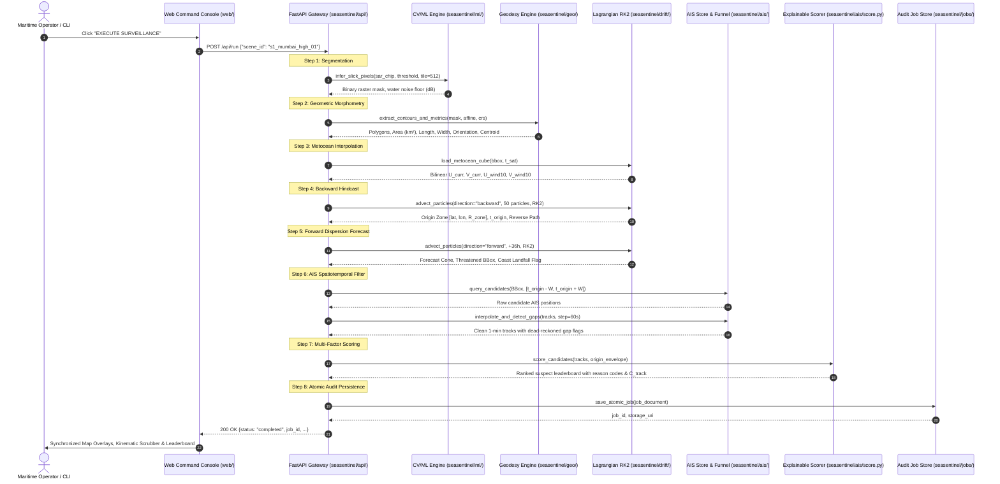

# SeaSentinel: Satellite Oil Spill Detection & AIS Attribution Intelligence Platform

[](#)
[](#)
[](#)
[](#)
[](#)

> **Problem Statement Title (SIH26143)**: *Leveraging satellite imagery to determine oil spills at sea along with AIS data correlations to identify the vessel responsible for the spill.*  
> **Sponsoring Agency**: National Technical Research Organisation (NTRO) / Smart India Hackathon (SIH 2026).

---

## The Problem Statement

Marine oil spills inflict catastrophic damage on sensitive coastal ecosystems, fisheries, and maritime economies, yet illegal tank-washing and operational discharges routinely stay unattributed to the polluting vessel. The core intelligence challenge is to detect an oil spill from remote sensing data (Synthetic Aperture Radar and optical Earth Observation imagery) and correlate it with maritime Automatic Identification System (AIS) trajectories to identify the culpable vessel.

The operational pipeline is required to:
- **(a) Detect and characterise** the oil spill, computing physical morphometric properties and estimating age if feasible;
- **(b) Integrate oceanographic and meteorological data** to hindcast the slick back to its origin point and time window, and forecast its future dispersion and coastal landfall risk;
- **(c) Attribute the spill to a vessel** using historical AIS data to reconstruct vessel traffic around the origin spatiotemporal envelope, filter out irrelevant traffic, and rank suspect vessels using explainable proximity, trajectory, and behavioural criteria.

---

## How SeaSentinel Answers It

| Clause | What SeaSentinel Does | Where It Lives | What You See On Screen |
| :--- | :--- | :--- | :--- |
| **(a) Detect oil in SAR** | Deep-learning U-Net segmentation over 512 px tiles of 2048 px dual-pol chips with cosine-tapered tile stitching (with adaptive dB baseline fallback) | `seasentinel/ml/infer.py` | High-contrast orange slick polygons on the interactive GIS chart |
| **(a) Reject look-alikes** | Dual-polarization backscatter ratio and morphometric filter separating mineral oil from biogenic slicks, low-wind calm water, and ship wakes | `seasentinel/ml/infer.py` | Yellow dashed polygons for look-alikes, excluded from attribution |
| **(a) Clean scene detection** | Radiometric contrast span evaluation against a calibrated ocean noise floor; prevents hallucinated detections | `seasentinel/ml/infer.py` | *"No slick. Uniform water."* badge with measured backscatter span |
| **(a) Geometric characterisation** | Local Azimuthal Equidistant projection, Moore boundary tracing, Douglas-Peucker simplification, and PCA orientation | `seasentinel/geo/geometry.py` | Total area (km²), perimeter, length, width, orientation, compactness, centroid, and bounding box |
| **(a) Age estimation** | Backward Lagrangian advection time elapsed between estimated origin release and radar acquisition pass | `seasentinel/pipeline.py` | Elapsed hours clearly labeled as a **drift proxy** (not unverified weathering) |
| **(a) EO corroboration** | Co-registered Sentinel-2 L2A multispectral optical chip comparison over the SAR footprint | `seasentinel/eo/corroborate.py` | Optional optical layer toggle and corroboration count in evidence rail |
| **(b) Metocean integration** | Cached ERA5 10 m wind and CMEMS global ocean surface current velocity grids, interpolated bilinearly in space and linearly in time | `seasentinel/drift/fields.py` | Wind speed, current velocity, field resolution, and cube time span printed on console cards |
| **(b) Origin point & time hindcast** | 50-particle Runge-Kutta 2nd Order (RK2) Lagrangian backward advection ensemble with wind leeway deflection | `seasentinel/drift/advection.py` | Backward trajectory track, frozen release zone polygon, origin timestamp, and uncertainty radius |
| **(b) Future dispersion forecast** | Forward RK2 advection ensemble generating 90th percentile swept dispersion cone and coastline collision detection | `seasentinel/drift/cones.py`<br>`seasentinel/coast.py` | Cyan forecast cone, threatened bounding polygon, and coast landfall impact alert |
| **(c) Historic AIS reconstruction** | Standard MarineCadastre SQLite database query, resampled to 1-minute intervals in LocalAEQD Cartesian coordinates | `seasentinel/ais/ingest.py`<br>`seasentinel/ais/interpolate.py` | High-resolution vessel tracks, scrubbable along the interactive timeline axis |
| **(c) Filter irrelevant traffic** | Spatiotemporal bounding box funnel pruning all traffic outside the release zone and temporal window | `seasentinel/ais/filter.py` | Dynamic funnel counts (Indexed -> In BBox -> Passed Filter) in evidence rail |
| **(c) Multi-criteria suspicion scoring** | 5-factor explainable scoring (proximity, temporal offset, drift alignment, vessel prior, behaviour) with dead-reckoning penalty | `seasentinel/ais/score.py` | Ranked suspect leaderboard with solid-to-hairline score bars and reason codes |
| **Suitable visual interface** | Pure vanilla HTML5/CSS3/ES6 and vendored Leaflet 1.9 GIS engine; zero framework or external CDN dependencies | `web/` | Three-rail tactical command console with dark/light themes and PDF memo export |

---

## The Tactical Command Console

The SeaSentinel dashboard is engineered as a three-rail tactical command interface designed for rapid intelligence triage:
- **Left Rail**: Scene selection catalog, execution parameters (hindcast hours, forecast hours, search radius, time window), and single-click analysis trigger.
- **Centre Rail**: Interactive full-viewport GIS map with layer controls (SAR chip, optical chip, oil polygons, backtrack track, release zone, forecast cone, AIS tracks, vessel marks), scrubbable timeline player, pipeline execution metrics, and environmental condition readouts.
- **Right Rail**: Evidence panels toggling between five dedicated operational views: **Investigate**, **Drift**, **Vessels**, **Method**, and **Data**.

### 1. Investigate View
*Detection, drift, and forecast on a single synchronized chart, with physical slick morphometry, radiometric contrast, and detector checkpoint metrics displayed alongside.*



### 2. Drift Reconstruction View
*The backward Lagrangian particle ensemble, the frozen release zone it converged upon, and the exact metocean current and wind vectors integrated at each timestep.*



### 3. Vessel Attribution Leaderboard
*The ranked suspect leaderboard. Every vessel entry carries its explainable reason codes, speed and course anomalies, and an evidence score bar that runs solid to the final score and continues as a hairline to the unpenalized evidence score. The gap visually indicates how much of the case relies on dead reckoning rather than authentic received AIS signals.*



### 4. Method & Explainable Scoring
*All weights, decay formulas, behavioral thresholds, and vessel type priors are served dynamically from `/api/config` and `/api/scoring` and rendered directly in the interface, allowing operators and analysts to verify the math rather than blindly trust a black-box output.*



### 5. Clean Scene Verification: "A Clean Scene is a Finding"
*The Arabian Sea test chip captures uniform, wind-roughened open water. Its co-polarization band spans only 1.95 dB after speckle averaging (compared to 7.0 dB on a slick scene). The detector correctly identifies zero oil polygons, and the console reports this as a verified measurement rather than an empty failure.*



---

## System Architecture


### 1. End-to-End System Pipeline & Dataflow (Mermaid)



### 2. Runtime Execution Lifecycle (Sequence Diagram)

When an operator triggers surveillance via the UI button (`EXECUTE SURVEILLANCE`) or headless CLI (`python3 main.py --run s1_mumbai_high_01`), the system executes a deterministic sequence:



### 3. The Offline Air-Gap Boundary

In defense intelligence operations (NTRO / Indian Coast Guard), software must function in air-gapped environments without live external network dependencies. SeaSentinel enforces an absolute architectural boundary:

```
[ External Data Sources ] (One-Time Ingest / Offline Cache)
  • Sentinel-1 IW GRD SAR (Copernicus / Planetary Computer)
  • MarineCadastre AIS Historical Archives
  • Open-Meteo ERA5 10m Wind & CMEMS Ocean Surface Currents
       │
       ▼ (scripts/prepare_scenes.py, scripts/build_metocean_cache.py)
[ Local Disk Cache: data/ ]
  • data/scenes/          (SAR GeoTIFFs & metadata catalog)
  • data/ais/ais.sqlite   (Indexed MarineCadastre vessel positions)
  • data/metocean/*.npz   (ERA5 wind & CMEMS current velocity grids)
═══════════════════════ AIR-GAP OFFLINE BOUNDARY ═══════════════════════
[ SeaSentinel Runtime Engine (seasentinel/) ] (100% OFFLINE, ZERO NETWORK)
  • FastAPI Application Server (main.py, port 8000)
  • ML Segmentation & Radiometric Analysis
  • Lagrangian RK2 Advection (Hindcast & Forecast)
  • LocalAEQD Geodesy & Contour Morphometry
  • Spatiotemporal AIS Filtering & 5-Factor Scoring
       │
       ▼
[ Tactical GIS Console (web/) & Maritime Attribution PDF Memo ]
```

### 4. What One Button Does (End-to-End Pipeline Trace)

When an operator clicks **Run Analysis** (or invokes `POST /api/run`), the pipeline executes sequentially and logs every step into an atomic JSON audit document (`data/jobs/<job_id>.json`):

```
SAR GeoTIFF (VV/VH dual-pol chip)
   │
   ├──▶ [1. DETECT] (seasentinel/ml/infer.py) ~25-30s on CPU
   │     PyTorch U-Net segmentation over 512px tiles with cosine tapering
   │     Produces: oil polygons, look-alike polygons, radiometric water level
   │
   ├──▶ [2. CHAR] (seasentinel/geo/geometry.py) ~800ms
   │     Moore boundary tracing, Douglas-Peucker simplification, PCA axis orientation
   │     Produces: area (km²), length, width, perimeter, compactness, orientation
   │
   ├──▶ [3. EO CORROBORATION] (seasentinel/eo/corroborate.py) ~150ms
   │     Optical Sentinel-2 RGB corroboration if optical chip is co-registered
   │
   ├──▶ [4. METOCEAN INGEST] (seasentinel/drift/fields.py) ~10ms
   │     Bilinear spatial & linear temporal interpolation over cached ERA5/CMEMS cubes
   │
   ├──▶ [5. HINDCAST] (seasentinel/drift/advection.py) ~700ms
   │     Runge-Kutta 2nd Order (RK2) backward Lagrangian advection of 50 seeded particles
   │     Produces: reverse drift trajectory, origin point, release zone envelope
   │
   ├──▶ [6. FORECAST] (seasentinel/drift/cones.py) ~500ms
   │     Forward RK2 advection with spread modeling and coastline collision test
   │     Produces: 36h dispersion cone, threatened bounding box, coast impact flag
   │
   ├──▶ [7. DRIFT AGE] (seasentinel/pipeline.py) ~1ms
   │     Hours elapsed from reverse origin convergence to radar acquisition timestamp
   │
   ├──▶ [8. AIS QUERY] (seasentinel/ais/ingest.py & interpolate.py) ~1.2s
   │     SQLite spatio-temporal query around origin envelope; 1-min track interpolation;
   │     Dead-reckoning identification for transmission gaps >= 30 min
   │
   ├──▶ [9. FILTER] (seasentinel/ais/filter.py) ~50ms
   │     Spatio-temporal funnel pruning irrelevant traffic outside window & search radius
   │
   └──▶ [10. SCORE] (seasentinel/ais/score.py) ~30ms
         Multi-factor explainable suspicion scoring:
         Proximity, Temporal Delta, Trajectory Drift Alignment, Vessel Prior, Behavior
         Produces: Ranked suspect leaderboard with confidence penalty & reason codes
```

---

## Tech Stack & Resilience

SeaSentinel is engineered so that every heavy geospatial dependency has a pure-Python, zero-dependency fallback. The platform runs reliably on modern developer workstations, edge servers, or barebones laptops:

| Layer | Primary Selection | Why | Builtin Zero-Dependency Fallback |
| :--- | :--- | :--- | :--- |
| **Runtime** | Python 3.10+ | Modern typing, asyncio, and cross-platform standard library | Standard Python interpreter |
| **API Framework** | FastAPI + Uvicorn | High-throughput asynchronous endpoints, automatic OpenAPI schemas | Asynchronous ASGI request dispatch |
| **Data Validation** | Pydantic v2 | Strict schema enforcement and serialization (`seasentinel/schemas.py`) | Native dataclasses and validation |
| **Numerics** | NumPy | High-performance vector operations and array math | The only mandatory scientific package |
| **Deep Learning** | PyTorch U-Net | Precision segmentation trained on Zenodo Sentinel-1 SAR imagery | Adaptive relative dB dark-patch thresholding (`seasentinel/ml/infer.py`) |
| **Raster IO** | Rasterio / GDAL | Georeferenced GeoTIFF reading and affine transformations | Pure-Python TIFF/Deflate reader (`seasentinel/geo/tiffio.py`) |
| **Cartographic Projection** | PyProj (PROJ.4) | Rigorous cartographic projections | Analytical Local Azimuthal Equidistant formulas (`seasentinel/geo/crs.py`) |
| **Morphology** | SciPy `ndimage` | Connected component labeling and kernel convolutions | Pure NumPy connected-components & morphological structuring |
| **Vector Geometry** | Shapely (GEOS) | Polygon buffering, intersections, and hull construction | Hand-written vector algorithms & ray-casting (`seasentinel/geo/geometry.py`) |
| **Job Store** | Atomic Disk JSON | Audit-grade, crash-resilient, human-readable run documents | Simple file-system atomic write |
| **AIS Database** | SQLite 3 | Lightweight, zero-config relational store for MarineCadastre tables | Standard Python built-in `sqlite3` |
| **Frontend UI** | Vanilla HTML5 / CSS3 / ES6 | Fast, lightweight, zero build tooling, zero node_modules | Vendored Leaflet 1.9 (no internet CDN) |
| **Reporting** | ReportLab / HTML | Official printable Maritime Pollution Attribution Memos | High-fidelity printable HTML with CSS `@media print` |

---

## Quickstart Guide

### 1. Installation

Clone the repository and create an isolated virtual environment:

```bash
git clone https://github.com/Pratyush-Singh-007/SeaSentinel.git
cd SeaSentinel

# Create and activate virtual environment
python3 -m venv .venv
source .venv/bin/activate       # On Linux / macOS
# .venv\Scripts\activate      # On Windows

# Install dependencies
pip install -r requirements.txt
```

### 2. Automatic Bootstrap & Server Launch

Launch the SeaSentinel server. On its initial startup, SeaSentinel automatically verifies the file structure, checks the database, registers demo Sentinel-1 SAR scenes, and prepares metocean grids:

```bash
python3 main.py
```

Now open your browser and navigate to:
```
http://localhost:8000
```

Select any scene in the left rail (e.g. **Mumbai High Offshore Basin**) and click **Run Analysis**. On a laptop CPU, the entire end-to-end pipeline completes in ~30 seconds, dynamically displaying step progress.

### 3. Headless CLI Execution

Execute pipeline analysis directly from the command line without opening a browser:

```bash
# Run analysis on a specific registered scene
python3 main.py --run s1_mumbai_high_01

# Inspect active configuration and weights
python3 main.py --config
```

### 4. Deep-Linking & Run Sharing

Finished analysis runs are stored as discrete audit cases that can be reopened and shared via direct URL hash fragments:
```
http://localhost:8000/#job=job_20260907T130159_3aa55f&view=vessels
```

---

## Datasets & Provenance

| Dataset / Source | Used For | License / Terms | Login Req? | Runtime Status |
| :--- | :--- | :--- | :--- | :--- |
| **Zenodo Sentinel-1 SAR Oil Spill Dataset** (Records 5142143 & 5221908) | U-Net deep learning training, validation, and IoU benchmark evaluation | Creative Commons Attribution 4.0 International (CC BY 4.0) | No | Offline (model weights bundled) |
| **Sentinel-1 C-Band SAR IW GRD** (Copernicus / Planetary Computer) | Dual-polarization (VV/VH) 10m ground-resolution radar imagery chips | Modified Copernicus Sentinel Data; CC BY 4.0 | No | Pre-cut & cached to `data/scenes/*.tif` |
| **Sentinel-2 MSI Level-2A** (Copernicus / Planetary Computer) | Multispectral optical imagery for cross-sensor slick corroboration | Modified Copernicus Sentinel Data; CC BY 4.0 | No | Pre-cut & cached to `data/optical/*.png` |
| **Open-Meteo Archive API (ERA5)** | 10 m atmospheric wind vector fields ($u_{10}, v_{10}$) | CC BY 4.0 (Free non-commercial) | No | Cached to `data/metocean/*.npz` |
| **Copernicus Marine Service (CMEMS)** (`GLOBAL_ANALYSISFORECAST_PHY_001_024`) | Hydrodynamic ocean surface current velocity fields ($u_{\text{curr}}, v_{\text{curr}}$) | E.U. Copernicus Marine Service Information | No | Cached to `data/metocean/*.npz` |
| **MarineCadastre.gov AIS Archives** | Real historical vessel broadcast positions in coastal & offshore waters | U.S. Government Public Domain | No | Extracted into `data/ais/ais.sqlite` |
| **Natural Earth 1:10m / 1:50m Land** | Coastline polygon vectors for forecast cone landfall impact analysis | Public Domain | No | Cached geometry in `seasentinel/coast.py` |
| **Synthetic AIS Generator** (`seasentinel/ais/sim.py`) | Realistic AIS traffic generation for areas outside public AIS archives | Proprietary algorithmic sim | No | Pre-populated into `data/ais/ais.sqlite` |

---

## The Four Demo Scenes

| Scene ID | Title / Location | Radar Pass (UTC) | AIS Mode | Coordinates | Description |
| :--- | :--- | :--- | :--- | :--- | :--- |
| `s1_mumbai_high_01` | **Mumbai High Offshore Basin (Arabian Sea)** | 2026-03-15 01:30 | MarineCadastre Schema (Simulated) | 19.42° N, 72.18° E | High-density Indian offshore oil production and crude tanker shipping fairway. |
| `s1_gulf_mexico_02` | **Gulf of Mexico Mississippi Canyon (MC20)** | 2026-05-10 11:45 | Real Historical MarineCadastre | 28.45° N, -89.35° W | Chronic offshore discharge site with heavy commercial vessel traffic and verified surface slicks. |
| `s1_malacca_strait_03` | **Strait of Malacca Transit Fairway** | 2026-07-22 23:15 | MarineCadastre Schema (Simulated) | 2.45° N, 101.40° E | High-density international tanker corridor with complex hydrodynamic coastal currents. |
| `s1_arabian_clean_04` | **Arabian Sea Deepwater Fairway (Clean Control)** | 2026-03-16 04:15 | MarineCadastre Schema (Simulated) | 19.65° N, 71.60° E | Clean ocean reference scene demonstrating zero false-positive detection on wind-roughened open water. |

---

## Detector Benchmark Metrics

The deep learning detector was trained for 40 epochs on 1,164 Sentinel-1 SAR tiles (best epoch 33) and evaluated against held-out validation data from the Zenodo benchmark dataset:

| Evaluation Metric | PyTorch U-Net Checkpoint | Adaptive dB Baseline | Operational Benefit |
| :--- | :---: | :---: | :--- |
| **IoU (Oil Class)** | **0.8891** | 0.0000 | Precise boundary capture of thin sheen and emulsified crude |
| **IoU (Sea Class)** | **0.9822** | 0.8645 | Highly accurate ocean clutter suppression |
| **Mean IoU (mIoU)** | **0.9356** | 0.2882 | Superior multi-class semantic segmentation |
| **Pixel Accuracy** | **0.9844** | 0.8645 | High global fidelity across varying sea states |
| **Water False Positive Rate** | **0.0106** | 0.0038 | Enforces hard ceiling (`FPR <= 0.02`) to prevent hallucinating oil on clean water |

> **The False Positive Gate**: In satellite oil spill detection, unconstrained IoU is monotone with predicting more oil. An unconstrained model can score high IoU by expanding masks over clean water. SeaSentinel strictly gates model training by requiring that water false positives remain $\le 2.0\%$.

---

## The Hydrodynamic Physics Formulation

### Surface Advection Vector

SeaSentinel models the total surface drift velocity vector $\vec{V}$ as a linear superposition of hydrodynamic ocean currents and atmospheric 10 m winds:

$$\vec{V} = \vec{U}_{\text{current}} + \alpha \cdot \mathbf{R}(\theta) \vec{U}_{\text{wind10}}$$

Where:
- $\vec{U}_{\text{current}}$ is the ocean surface current velocity vector from CMEMS;
- $\vec{U}_{\text{wind10}}$ is the 10 m wind velocity vector from ERA5;
- $\alpha = 0.03$ (the standard **3% wind leeway factor** recommended by OpenDrift when Stokes drift is not double-counted);
- $\mathbf{R}(\theta)$ is the leeway deflection rotation matrix:
  $$\mathbf{R}(\theta) = \begin{bmatrix} \cos\theta & \sin\theta \\ -\sin\theta & \cos\theta \end{bmatrix}$$
  Deflecting wind-driven surface drift by $\theta = 15^\circ$ clockwise to the right in the Northern Hemisphere (Coriolis-induced surface shear).

### Numerical Integration (Runge-Kutta 2nd Order)

To eliminate severe latitude and polar map-projection distortions, numerical integration is executed in a dynamically re-centered **Local Azimuthal Equidistant (LocalAEQD)** Cartesian frame:

$$x_m = x_0 \pm \frac{\Delta t}{2} \vec{V}(x_0, t_0)$$
$$x(t \pm \Delta t) = x_0 \pm \Delta t \cdot \vec{V}\left(x_m, t_0 \pm \frac{\Delta t}{2}\right)$$

- **Hindcasting (Backward Advection, $\Delta t < 0$)**: Advects the particle cloud backward in time from the radar pass to reconstruct the release point.
- **Forecasting (Forward Advection, $\Delta t > 0$)**: Predicts trajectory up to 36 hours ahead, generating the 90th percentile swept cone and evaluating coastline intersections.

### Ensemble Seeding & Frozen Origin Trigger

1. **Rejection Sampling**: 50 particles are seeded uniformly within the detected oil polygon, preserving the true physical morphology of the slick.
2. **Velocity Perturbations**: Each particle carries Gaussian velocity perturbations ($\sigma_{\text{curr}} = 0.05\text{ m/s}$, $\sigma_{\text{wind}} = 0.5\text{ m/s}$) to model sub-grid turbulence and dispersion.
3. **Frozen Origin Rule**: The backward ensemble is integrated hour-by-hour until the 90th percentile radial dispersion $\sigma_R$ reaches the uncertainty threshold:
   $$\sigma_R \ge R_{\text{trigger}} = 6.0\text{ km}$$
   At this point, hydrodynamic physics ceases to be informative, and the spatiotemporal release envelope is frozen and handed to the AIS attribution module.

---

## Explainable Suspicion Scoring Formulation

Suspect vessels inside the spatiotemporal origin window are scored using a normalized multi-criteria model bounded in $[0, 100\%]$:

$$\text{Raw Score} = \frac{w_{\text{prox}} S_{\text{prox}} + w_{\text{time}} S_{\text{time}} + w_{\text{traj}} S_{\text{traj}} + w_{\text{type}} S_{\text{type}} + w_{\text{beh}} S_{\text{beh}}}{\sum w_i}$$

$$\text{Final Score} = 100 \times \text{Raw Score} \times C_{\text{track}}$$

### The Five Sub-Scores ($w = [0.30, 0.20, 0.10, 0.15, 0.25]$):

1. **Proximity Score ($S_{\text{prox}}$, weight 0.30)**: Exponential decay based on distance from closest point of approach ($d_{\text{origin}}$) to the estimated origin center:
   $$S_{\text{prox}} = \exp\left( - \frac{d_{\text{origin}}}{R_{\text{zone}}} \right)$$
   *(At origin center: 1.00; at zone perimeter $R$: 0.37; at $2R$: 0.13)*.
2. **Temporal Offset Score ($S_{\text{time}}$, weight 0.20)**: Exponential decay based on time delta between vessel passage and estimated release timestamp:
   $$S_{\text{time}} = \exp\left( - \frac{|\Delta t|}{\tau_h} \right) \quad (\tau_h = 1.5\text{ hours})$$
3. **Trajectory Drift Alignment ($S_{\text{traj}}$, weight 0.10)**: Compares the vessel course over ground (COG) against the reverse drift vector from origin to slick:
   $$S_{\text{traj}} = \begin{cases} 1.0 & \text{if } |\text{COG} - \theta_{\text{origin}\to\text{slick}}| \le 45^\circ \\ 0.4 & \text{otherwise} \end{cases}$$
4. **Vessel Type Prior ($S_{\text{type}}$, weight 0.15)**: Risk priors derived from historical MARPOL discharge statistics and ITU-R M.1371 codes:
   - Crude Oil Tanker: $1.00$
   - Chemical Tanker: $0.90$
   - General Tanker: $0.85$
   - Bulk Carrier / Cargo: $0.50$
   - Container Ship: $0.45$
   - Fishing Vessel: $0.20$
   - Passenger Craft: $0.05$
   - Other / Unknown: $0.30$
5. **Behavioral Anomalies ($S_{\text{beh}}$, weight 0.25)**: Evaluates intentional discharge signatures:
   - **Operational Discharge Speed**: Vessel moving at typical bilge/slop discharge speed ($8 \text{ to } 16\text{ knots}$) $\to 0.70$
   - **Maneuvering Course Deviation**: Course alteration $> 30^\circ$ within 20 minutes of origin $\to 0.60$
   - **Speed Fluctuation**: Speed swing $> 5\text{ knots}$ in proximity $\to 0.50$
   - **Deliberate AIS Silence**: AIS transmission gap $\ge 30\text{ min}$ whose dead-reckoned track traverses within 5 km of the origin zone $\to 0.95$ (reduced to $0.35$ if total receptions $< 6$, indicating poor coastal receiver coverage rather than deliberate evasion).

### Track Confidence Multiplier ($C_{\text{track}}$)

To prevent phantom accusations based solely on unverified dead reckoning:
$$C_{\text{track}} = \max\left(0.35, \, 1.0 - 0.65 \times \text{Fraction}_{\text{DeadReckoned}}\right)$$
*Vessels with sparse or unverified receptions are penalized proportionally, and the console displays the unpenalized evidence as a hairline extension on the score bar.*

### Four Critical Algorithmic Corrections:
1. **Origin Point Proximity**: Distance is measured to the origin center point rather than the zone perimeter. (Measuring to the perimeter caused score saturation at 1.0 across large 200 km² search zones).
2. **Temporal Exponential Scoring**: Time is mathematically scored with decay, rather than acting as a binary filter that treats a 3-hour offset identically to a 0-minute intercept.
3. **Observation Confidence Weighting**: Penalizes vessels whose track across the spill site was entirely interpolated, ensuring authentic receptions outrank speculative tracks.
4. **Absolute Ranking**: Scores are absolute percentages, never min-max normalized across a batch. On clean scenes or low-risk transits, the leaderboard remains honest and empty.

---

## Codebase Module Map

```
sih 2.0/
├── seasentinel/                  # Core Algorithmic & Intelligence Engine
│   ├── __init__.py             # Package declaration & version exports
│   ├── config.py               # Central frozen constants, physics parameters, scoring weights
│   ├── schemas.py              # Pydantic v2 data models for API requests/responses
│   ├── pipeline.py             # End-to-end multi-stage pipeline orchestrator
│   ├── scenes.py               # SAR scene catalog, metadata index, and bounding boxes
│   ├── coast.py                # Global coastline vectors & landfall impact analysis
│   ├── api/                    # Modular FastAPI Route Handlers
│   │   ├── health.py           # Health check, GPU/MPS hardware detection, DB stats
│   │   ├── config.py           # Runtime configuration & explainability endpoint
│   │   ├── scenes.py           # Scene listing & footprint geometries
│   │   ├── detect.py           # Direct SAR segmentation & GeoTIFF upload handler
│   │   ├── drift.py            # Lagrangian advection, hindcast & forecast endpoints
│   │   ├── ais.py              # Vessel track querying & spatio-temporal filtering
│   │   ├── pipeline.py         # Full automated execution endpoint (POST /api/run)
│   │   ├── demo.py             # Interactive operator probe injection
│   │   ├── jobs.py             # Atomic JSON job document retrieval & GeoJSON export
│   │   └── report.py           # Maritime Pollution Attribution Note (HTML & PDF)
│   ├── ais/                    # AIS Processing & Attribution Engine
│   │   ├── ingest.py           # MarineCadastre CSV/SQLite ingest and indexing
│   │   ├── interpolate.py      # 1-minute track resampling & dead-reckoning gap detection
│   │   ├── filter.py           # Spatio-temporal candidate funneling
│   │   ├── score.py            # 5-factor explainable scoring & confidence calculation
│   │   ├── sim.py              # Realistic traffic simulator (culprit + distractors)
│   │   └── vessel_types.py     # ITU-R M.1371 decoding & risk prior mapping
│   ├── drift/                  # Oceanographic & Atmospheric Drift Simulation
│   │   ├── advection.py        # RK2 2D Lagrangian surface advection engine
│   │   ├── cones.py            # Swept dispersion cones & release zone envelopes
│   │   └── fields.py           # ERA5 wind & CMEMS ocean current interpolator
│   ├── eo/                     # Multispectral Earth Observation Corroboration
│   │   └── corroborate.py      # Sentinel-2 L2A optical validation & contrast checks
│   ├── geo/                    # Zero-Dependency Cartographic & Spatial Engine
│   │   ├── crs.py              # Local Azimuthal Equidistant projection (LocalAEQD)
│   │   ├── geometry.py         # Moore boundary trace, Douglas-Peucker, PCA orientation
│   │   ├── raster.py           # GeoTIFF raster affine transforms & window extraction
│   │   └── tiffio.py           # Pure-Python zero-dependency TIFF reader & writer
│   ├── jobs/                   # Persistent Job Store & Audit Trail
│   │   └── store.py            # Atomic JSON writes, disk retention pruning & status tracking
│   └── ml/                     # Machine Learning & Segmentation Engine
│       ├── model.py            # PyTorch U-Net neural architecture builder
│       └── infer.py            # Tiled sliding-window inference & adaptive dB baseline
├── web/                        # Modern Responsive Web GIS Command Center
│   ├── index.html              # Responsive tactical GIS UI with Leaflet
│   ├── style.css               # Tactical dark-theme stylesheet with WCAG 4.5:1 contrast
│   ├── app.js                  # Frontend state controllers, timeline player, layer managers
│   └── vendor/leaflet/         # Vendored Leaflet 1.9.4 assets (air-gap offline ready)
├── scripts/                    # Offline Data Ingest & Preparation Lane
│   ├── prepare_scenes.py       # Cut and calibrate SAR GeoTIFF demo scenes
│   ├── build_synthetic_ais.py  # Populate SQLite with realistic AIS traffic corridors
│   ├── build_metocean_cache.py # Precompute and cache ERA5 wind & CMEMS current grids
│   └── download_zenodo_subset.py # Helper to download and inspect Zenodo SAR archives
├── tests/                      # Verification & Compliance Test Suite
│   └── test_pipeline.py        # Automated assertions covering physics, AIS, and geometry
├── docs/                       # Architectural Specifications & Verification Matrices
│   ├── ARCHITECTURE.md         # Detailed offline boundary & zero-dependency architecture
│   ├── COMPLIANCE.md           # SIH26143 problem statement clause compliance matrix
│   └── screenshots/            # High-resolution screenshots of the 5 console views
├── main.py                     # Application server entrypoint and CLI runner
└── requirements.txt            # Python dependencies (with optional fallbacks)
```

---

## API Endpoint Reference

| Method | Endpoint | Description | Query / Body Parameters |
| :---: | :--- | :--- | :--- |
| `GET` | `/api/health` | System health, GPU/MPS hardware detection, DB row counts, and storage bounds | None |
| `GET` | `/api/config` | Active configuration parameters, scoring weights, and mathematical formulas | None |
| `GET` | `/api/scenes` | List of all registered SAR scenes with footprints, timestamps, and AIS mode | None |
| `POST` | `/api/detect` | Execute SAR segmentation on a registered scene | `{"scene_id": "s1_mumbai_high_01"}` |
| `POST` | `/api/detect/upload` | Upload and analyze an arbitrary SAR GeoTIFF scene | Multipart form file |
| `POST` | `/api/drift` | Execute forward/backward drift advection from coordinates | `{"lat": 19.42, "lon": 72.18, "hours": 24}` |
| `POST` | `/api/attribute` | Query, filter, and score AIS vessels around an origin envelope | `{"lat": 19.42, "lon": 72.18, "t_origin": "..."}` |
| `POST` | `/api/run` | **Execute complete end-to-end pipeline** (Detect -> Drift -> Attribute) | `{"scene_id": "s1_mumbai_high_01"}` |
| `POST` | `/api/demo/inject` | Operator coordinate probe analysis at arbitrary lat/lon coordinates | `{"lat": 19.42, "lon": 72.18, "t_sat": "..."}` |
| `GET` | `/api/jobs/{job_id}` | Retrieve complete JSON audit document for an executed run | `job_id` path parameter |
| `GET` | `/api/jobs/{job_id}/geojson` | Export all run layers (slicks, cones, tracks) as standard GeoJSON | `job_id` path parameter |
| `GET` | `/api/report/{job_id}` | Official **Maritime Pollution Attribution Note** in printable HTML format | `job_id` path parameter |
| `GET` | `/api/report/{job_id}/pdf` | Download official attribution note as an audit PDF document | `job_id` path parameter |
| `GET` | `/api/ais/track/{mmsi}` | Fetch 1-minute reconstructed vessel track with dead-reckoning markers | `mmsi` path parameter |

---

## Test Suite & Verification

Run the automated test suite to verify physics reversibility, cartographic accuracy, and attribution scoring:

```bash
pytest tests/test_pipeline.py -v
```

### Core Tests That Carry Weight:
1. `test_crs_math`: Verifies Haversine distances, geodetic bearings, and exact Cartesian round-trip conversions in `LocalAEQD` ($< 10^{-5}$ degrees).
2. `test_geometry_metrics`: Confirms connected-component segmentation, closed Moore boundary tracing, and Douglas-Peucker contour simplification.
3. `test_drift_rk2_reversibility`: Validates that a 6-hour backward advection mathematically reverses a 6-hour forward advection within $< 0.1\text{ km}$ under Runge-Kutta 2nd Order integration.
4. `test_vessel_type_priors`: Verifies correct ITU-R M.1371 decoding and prior probability assignments (Crude tanker $1.0$, Chemical tanker $0.90$, Fishing $0.20$).
5. `test_score_track_explainability`: Asserts mathematical validity of the 5-factor scoring model and presence of explainable reason codes.
6. `test_probe_pipeline_execution`: Drives full end-to-end pipeline execution from arbitrary coordinates to suspect leaderboard completion.
7. `test_report_generation`: Validates generation of official Maritime Pollution Attribution Notes containing slick geometry, drift physics, and ranked evidence.
8. `test_playback_kinematics_data`: Ensures hourly slick centroids and vessel positions are populated for animated timeline playback.

---

## Configuration Reference

Every parameter in `seasentinel/config.py` can be overridden via environment variables without code modifications:

| Environment Variable | Default | Description |
| :--- | :---: | :--- |
| `SEASENTINEL_ALPHA_WIND` | `0.03` | Wind leeway drift factor (3% standard surface drift) |
| `SEASENTINEL_DEFLECTION_DEG` | `0.0` | Wind leeway deflection angle (clockwise in N hemisphere) |
| `SEASENTINEL_DT_SECONDS` | `3600` | Runge-Kutta integration time step (1 hour) |
| `SEASENTINEL_CURRENT_NOISE_MS` | `0.05` | Hydrodynamic current velocity perturbation (m/s) |
| `SEASENTINEL_WIND_NOISE_MS` | `0.5` | Atmospheric wind velocity perturbation (m/s) |
| `SEASENTINEL_SPREAD_TRIGGER_KM` | `6.0` | 90th percentile radial dispersion trigger to freeze origin zone |
| `SEASENTINEL_ORIGIN_BUFFER_KM` | `3.0` | Spatial buffer added around the frozen origin envelope |
| `SEASENTINEL_ORIGIN_H_MIN` | `1.0` | Minimum allowable hindcast duration (hours) |
| `SEASENTINEL_ORIGIN_H_MAX` | `24.0` | Maximum allowable hindcast duration (hours) |
| `SEASENTINEL_W_PROX` | `0.30` | Scoring weight for vessel proximity to origin point |
| `SEASENTINEL_W_TIME` | `0.20` | Scoring weight for temporal offset at closest approach |
| `SEASENTINEL_W_BEH` | `0.25` | Scoring weight for behavioral anomalies and AIS gaps |
| `SEASENTINEL_W_TYPE` | `0.15` | Scoring weight for vessel type risk prior |
| `SEASENTINEL_W_TRAJ` | `0.10` | Scoring weight for trajectory drift alignment |
| `SEASENTINEL_KEEP_JOBS` | `50` | Maximum number of JSON job audit logs retained on disk |
| `SEASENTINEL_KEEP_JOB_OVERLAYS` | `20` | Maximum number of rendered PNG overlays retained |
| `SEASENTINEL_OFFLINE` | `1` | Air-gapped offline enforcement (1 = strict offline, 0 = live enabled) |

---

## Operational Feeds vs. Demo Defaults

SeaSentinel is designed for seamless transition from offline hackathon demonstration to live 24/7 maritime command deployment:

| Stream | Operational Deployment Path | Demo Default Path | Implementation File |
| :--- | :--- | :--- | :--- |
| **AIS Stream** | Continuous WebSocket ingest (`wss://stream.aisstream.io/v0/stream`) or national AIS receiver feeds logged into SQLite | Pre-indexed MarineCadastre historical archives and simulated traffic | `seasentinel/ais/ingest.py`<br>`seasentinel/ais/sim.py` |
| **Metocean Grids** | Dynamic hourly query to Open-Meteo ERA5 API and CMEMS global ocean forecasting services | Precomputed, frozen spatial grids cached as `.npz` files | `seasentinel/drift/fields.py` |
| **SAR Imagery** | Automated directory watcher or Copernicus Data Space API pull triggering runs on new satellite passes | Pre-cut Sentinel-1 Level-1 GRD GeoTIFF chips | `seasentinel/scenes.py`<br>`scripts/prepare_scenes.py` |

---

## Honest Limitations & Operational Boundaries

To maintain intelligence-grade credibility, SeaSentinel explicitly articulates its operational boundaries:
1. **Attribution is Ranked Likelihood, Not Legal Proof**: The output represents a probabilistic, evidence-based ranking indicating which vessel warrants official boarding, inspection, or flag-state inquiry.
2. **SAR Archive Imagery**: The demo utilizes historical Sentinel-1 acquisitions from open archives rather than live tactical satellite tasking.
3. **Drift Age as a Physical Proxy**: Estimated slick age represents elapsed advection hours between reverse particle convergence and the satellite pass, rather than a chemical hydrocarbon weathering model.
4. **Origin is a Confidence Envelope**: The release site is presented as an uncertainty polygon representing the 90th percentile particle envelope, rather than a misleading single-coordinate pin.
5. **AIS Coverage Discretion**: The scoring engine explicitly differentiates between deliberate AIS manipulation (evasion) and sparse satellite/terrestrial receiver coverage by penalizing confidence rather than inflating guilt.

---

## License & Acknowledgements

- **Software License**: Distributed under the [MIT License](LICENSE).
- **Data Acknowledgements**:
  - European Space Agency (ESA) & European Commission Copernicus Programme for Sentinel-1 SAR and Sentinel-2 MSI data.
  - Copernicus Marine Service (CMEMS) for global hydrodynamic current reanalysis products.
  - European Centre for Medium-Range Weather Forecasts (ECMWF) & Open-Meteo for ERA5 reanalysis winds.
  - Bureau of Ocean Energy Management (BOEM) and NOAA for MarineCadastre AIS archives.
  - Smart India Hackathon (SIH 2026) & National Technical Research Organisation (NTRO) for Problem Statement 26143.