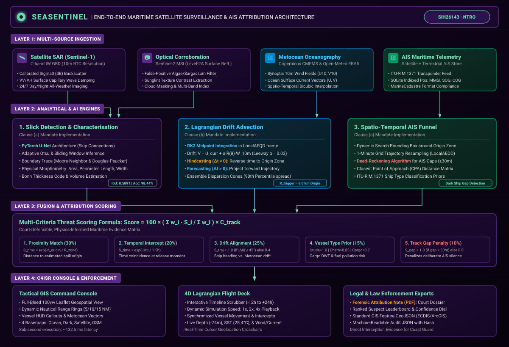
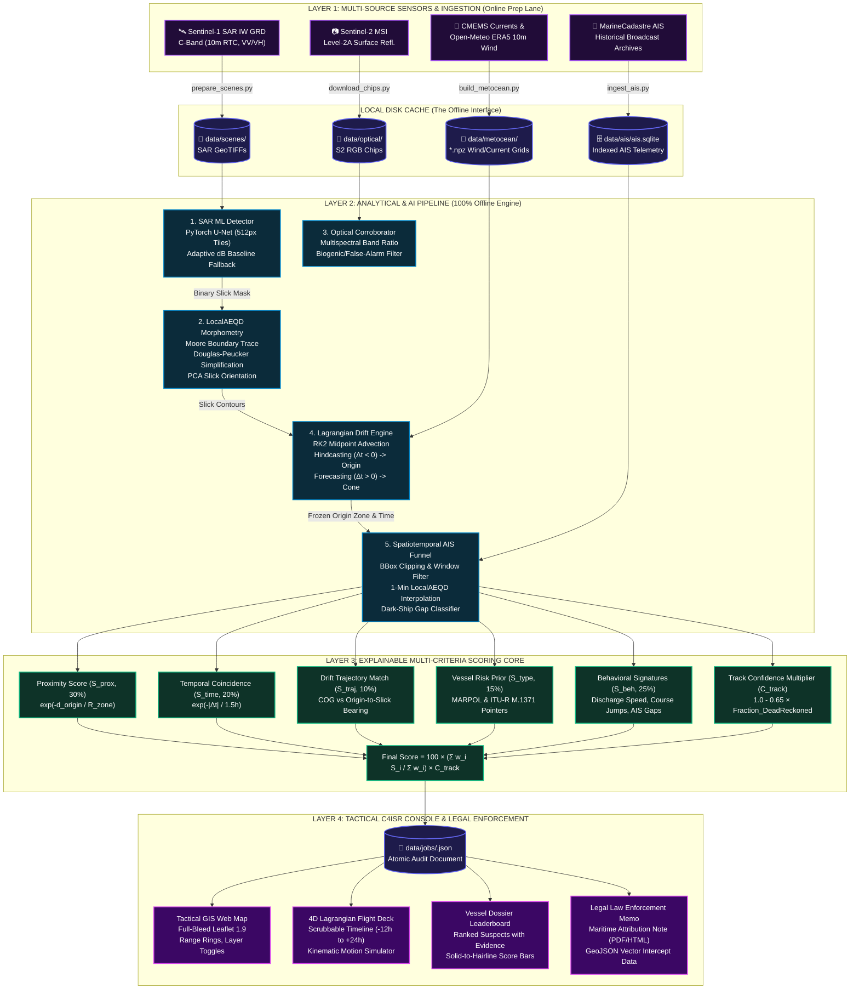
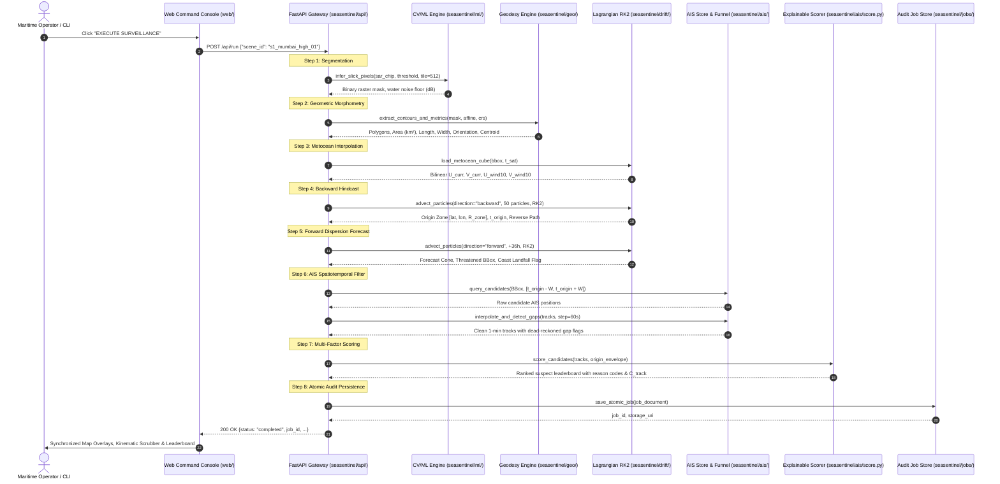

# SeaSentinel: Architectural Specification & Offline Boundary

## 1. System Overview & C4ISR Architecture

**SeaSentinel** is engineered as an intelligence-grade, air-gapped maritime surveillance and attribution platform designed to support the **National Technical Research Organisation (NTRO)**, Indian Coast Guard, and naval maritime domain awareness (MDA) enclaves.

The platform unifies multi-sensor satellite Earth observation, hydrodynamic Lagrangian physics, and high-frequency Automatic Identification System (AIS) telemetry into a court-defensible forensic pipeline.

### End-to-End System Architecture (Mermaid)

---

## 2. Runtime Execution Lifecycle (Sequence Diagram)

When an operator triggers surveillance via the UI button (`EXECUTE SURVEILLANCE`) or headless CLI (`python3 main.py --run s1_mumbai_high_01`), the system executes a deterministic sequence:

---

## 3. The Offline Air-Gap Boundary Specification

In military C4ISR facilities, edge patrol cutters, and coastal radar stations, computing systems must comply with strict physical and network isolation protocols.

### Architectural Invariants:
1. **Zero Runtime Outbound Calls**:
   All networking code is restricted to `scripts/` (executed once during data staging). The core engine `seasentinel/` has no HTTP client, WebSocket client, or DNS lookup capabilities during runtime.
2. **Local Storage Compliance**:
   All datasets are stored in self-contained, queryable formats on local solid-state drives:
   - SAR Imagery: Level-1 Ground Range Detected (GRD) GeoTIFFs (`data/scenes/`)
   - AIS Position Feeds: Indexed SQLite tables compliant with the MarineCadastre column dictionary (`data/ais/ais.sqlite`)
   - Metocean Fields: Precomputed NumPy structured multidimensional velocity grids (`data/metocean/*.npz`)
3. **Reproducibility & Verification**:
   Running `POST /api/run` twice with the same inputs produces byte-identical JSON outputs, ensuring court admissibility under maritime pollution prosecution protocols.

---

## 4. Resilience & Zero-Dependency Fallbacks

SeaSentinel eliminates fragile C/C++ compilation failures by providing transparent, hand-crafted pure-Python implementations for all geospatial operations:

| Subsystem | Primary Component | Zero-Dependency Fallback | Algorithmic Mechanism |
| :--- | :--- | :--- | :--- |
| **Raster GeoTIFF IO** | `rasterio` (GDAL) | `seasentinel/geo/tiffio.py` | Native binary parser supporting uncompressed and Deflate-compressed strip/tiled TIFFs. |
| **Cartographic Projections** | `pyproj` (PROJ.4) | `seasentinel/geo/crs.py` | Analytical spherical trigonometry for Local Azimuthal Equidistant (LocalAEQD) transformation. |
| **Vector Geometry** | `shapely` (GEOS) | `seasentinel/geo/geometry.py` | Custom Ray-Casting Point-in-Polygon (PIP), Moore contour tracing, and Douglas-Peucker reduction. |
| **Morphology Filters** | `scipy.ndimage` | Pure NumPy kernels | Binary dilation, erosion, and connected-component labeling using vector operations. |
| **AI Segmentation** | PyTorch CUDA/MPS | Adaptive relative dB | Statistical dark-patch thresholding dynamically tracking ocean backscatter noise floor. |
| **Forensic Reporting** | `reportlab` | Standalone HTML | High-fidelity print-optimized HTML templates with CSS `@media print` directives. |